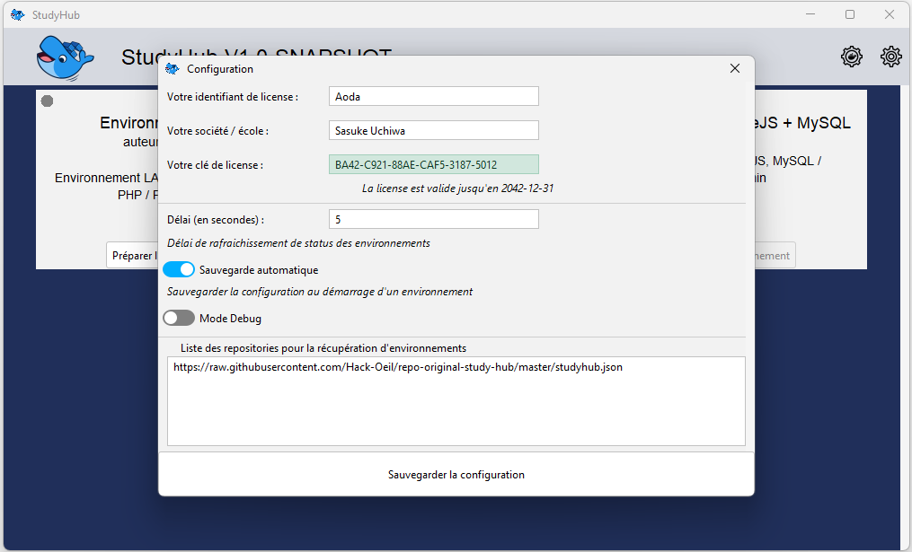

# Repo d'origine pour StudyHub

Ce Repository est le repository principal pour StudyHub.

# StudyHub c'est quoi ?
StudyHub est une application permettant de monter des environnements docker préparés.

